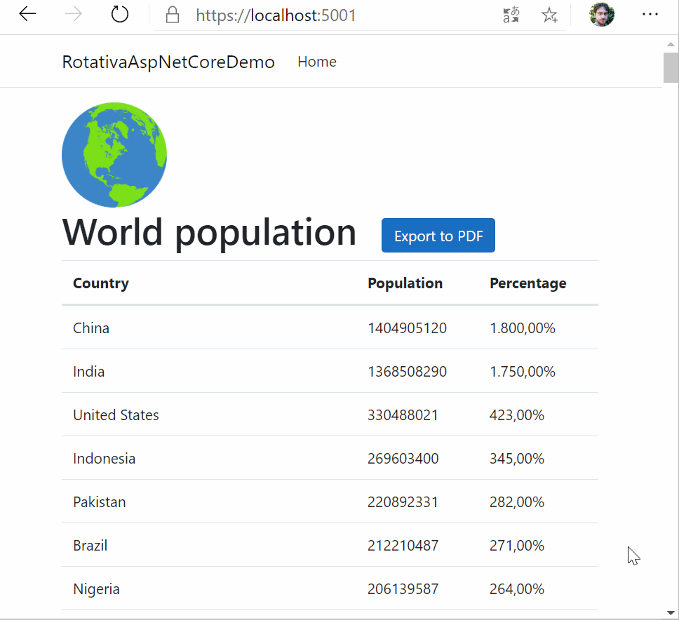

# RotativaAspNetCoreDemo
Sample ASP.NET Core 3.1 application using [Rotativa.AspNetCore](https://www.nuget.org/packages/Rotativa.AspNetCore/) to create a PDF from a Razor View. It also shows how to use HTML header and footer files.



## Needs configuration
[Rotativa.AspNetCore](https://www.nuget.org/packages/Rotativa.AspNetCore/) depends on [wkhtmltopdf](https://wkhtmltopdf.org/), so you'll have to download its binaries and copy them in the `Rotativa` directory of this project.

You can find configuration instructions on the [GitHub repository of Rotativa.AspNetCore](https://github.com/webgio/Rotativa.AspNetCore#needs-configuration)

## A guided tour
The important parts of this project are in file [Startup.cs](Startup.cs), where Rotativa is configured...

```csharp
public void Configure(IApplicationBuilder app, IWebHostEnvironment env, Microsoft.AspNetCore.Hosting.IHostingEnvironment hostingEnv)
{
  RotativaConfiguration.Setup(hostingEnv, "../Rotativa");
  // ...
}
```

...and in [Controllers/HomeController.cs](Controllers/HomeController.cs) where Rotativa is used to output a PDF by using a Razor Page
```csharp
string authority = $"{(Request.IsHttps ? "https" : "http")}:/{Request.Host}";
string headerHtml = $"{authority}/ExportHeader.html";
string footerHtml = $"{authority}/ExportFooter.html";
return new ViewAsPdf
{
    Model = viewModel,
    PageMargins = new Margins { Left = 10, Right = 10, Top = 20, Bottom = 20 },
    PageSize = Size.A4,
    PageOrientation = Orientation.Portrait,
    CustomSwitches = $"--header-html \"{headerHtml}\" --footer-html \"{footerHtml}\" --header-spacing 5 --footer-spacing 5"
};
```

The Razor View itself is [Views/Home/Index.cshtml](Views/Home/Index.cshtml) which is selecting the [Views/Shared/_ExportLayout.cshtml](Views/Shared/_ExportLayout.cshtml) on export.

Header and footer files are located in [wwwroot/ExportHeader.html](wwwroot/ExportHeader.html) and [wwwroot/ExportFooter.html](wwwroot/ExportFooter.html)